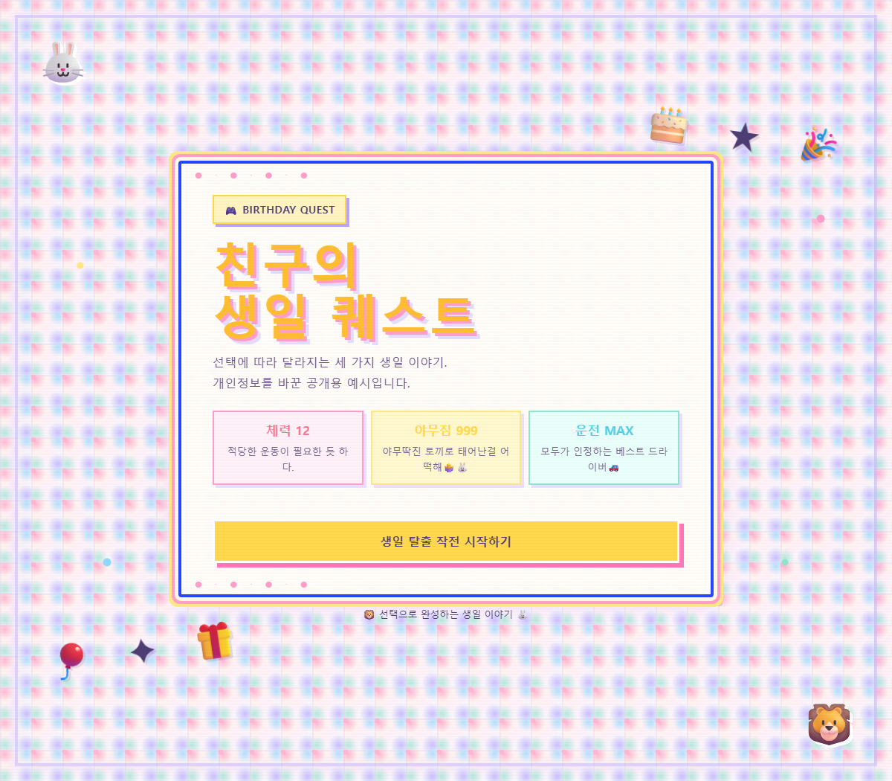
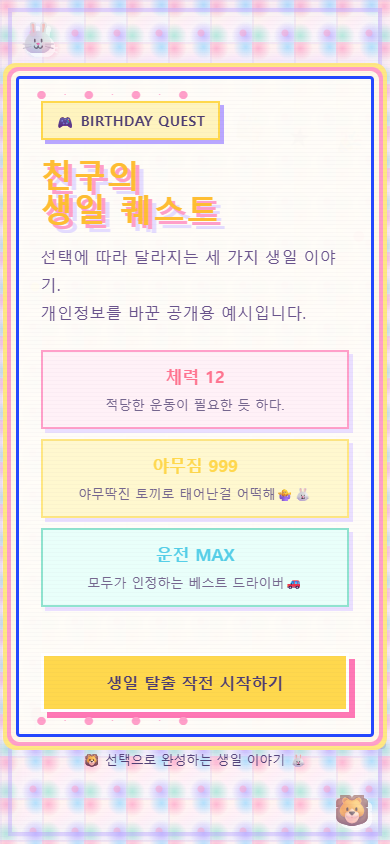

# 생일 축하 미니게임

지인의 취향과 추억을 반영한 메시지를 선택형 게임으로 전달한 개인 프로젝트입니다. 공개본은 원본의 HTML·CSS와 상태·분기 코드를 바탕으로 이름·장소·사진·개인 대화를 일반 이야기로 바꿨습니다.

## 실행과 화면

`index.html`을 브라우저에서 열면 플레이할 수 있습니다. 서버·로그인·외부 API가 필요하지 않습니다. 결과 복사 기능은 브라우저의 클립보드 권한과 실행 환경에 따라 제한될 수 있습니다.

## 실제 구현에서 다룬 내용

- 선택값을 `state`에 저장하고 다음 장면으로 이동
- 선택 조합에 따른 세 가지 엔딩과 우선순위
- 다시 시작할 때 선택 상태 초기화
- `width: min(92vw, 720px)`, `clamp()`와 520px 미디어 쿼리를 통한 화면 배치
- 엔딩 결과 복사

## 나의 역할과 AI 활용

만들고 싶은 경험과 이야기 방향을 정하고, 생성형 AI의 도움으로 디자인·코드 초안을 구현했습니다. HTML·CSS·JavaScript와 GUI 관련 사전 지식을 바탕으로 문구·디자인·화면 크기에 따른 배치를 수정하고 실행 결과를 확인했습니다. AI 없이 모든 코드를 독자 작성한 프로젝트로 설명하지 않습니다.

## 공개용 변경

이번 정리에서 이름·개인적 이야기·사진을 제거하고 일반 축하 이야기로 대체했습니다. 개인 취향에 따른 선택 상태와 엔딩 구조는 유지했습니다. 외부 폰트 요청도 제거해 로컬에서 화면을 볼 수 있게 했습니다. 공개용 스크린샷과 분기 검증은 정리 단계에서 새로 수행한 작업입니다.

플레이 가능 링크: https://iridescent-croquembouche-2e6aa8.netlify.app/

게임은 Python·데이터 분석 실적이 아니라 AI 활용 개발, 요구사항 구체화, 화면 구현 경험을 보여주는 보조 사례입니다. 상용 게임 개발·사용자 지표·성능 개선 수치를 주장하지 않습니다.
