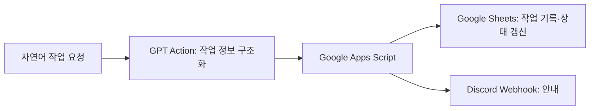

# ShieldDive | 게임 제작과 팀 작업 관리 자동화

[]

**5인 팀의 기획과 일정 관리를 맡고, 메인 화면·사운드 구현과 작업 관리 자동화에 참여했습니다.**

[게임 플레이](https://coleyoung-game.github.io/Web_ShieldDive/) · [전체 포트폴리오](../../README.md)

- 기간: 2024.12~2025.02
- 형태: 게임랩 소모임, 5인 팀
- 담당: 기획팀장 및 보조개발
- 기술: Unity, C#, ChatGPT, GPT Action, Google Apps Script, Google Sheets, Discord Webhook

## 문제와 담당 범위

방패를 이용해 장애물을 공격·회피하며 목표 지점까지 내려가는 픽셀 액션게임을 제작했습니다. 게임 규칙과 플레이 흐름을 기획하고, 제작 일정과 팀 진행 상황을 관리했습니다. 개발에서는 메인 화면과 사운드를 담당했습니다. 핵심 플레이 로직과 일부 플레이 화면은 다른 팀원이 구현했습니다.

## 작업 관리 자동화

팀 작업을 등록하고 진행 상태를 확인하거나 마감 안내를 공유하는 반복 흐름을 자동화 대상으로 정했습니다.

기존 작업 기록에서 작업 추가·상태 갱신·마감 공유 흐름의 구현과 동작 확인을 남겼습니다. 자연어 요청을 구조화해 기록·알림 시스템과 연결한 경험입니다.

## 결과와 근거 범위

| 항목 | 확인 가능한 내용 |
|---|---|
| 협업 규모 | 5인 팀 |
| 본인 개발 범위 | 메인 화면, 게임 사운드 |
| 기획·관리 | 게임 규칙·플레이 흐름, 제작 일정·진행 상황 관리 |
| 자동화 흐름 | 작업 추가·상태 갱신·마감 안내 |
| 공개 자료 | 게임 플레이 링크, 종합 포트폴리오의 화면 및 담당 범위 |

이 폴더는 경험을 정리한 문서입니다. Unity 전체 소스와 Apps Script·Action 설정 원본은 현재 공개 자료에 포함되어 있지 않습니다.

## 기술적 학습

사용자 요청을 작업 정보로 변환하는 단계와 실제 기록·알림을 수행하는 단계를 구분했습니다. 게임 제작에서는 팀 전체 산출물과 직접 담당한 기능을 나눠 설명할 수 있도록 역할을 정리했습니다.
